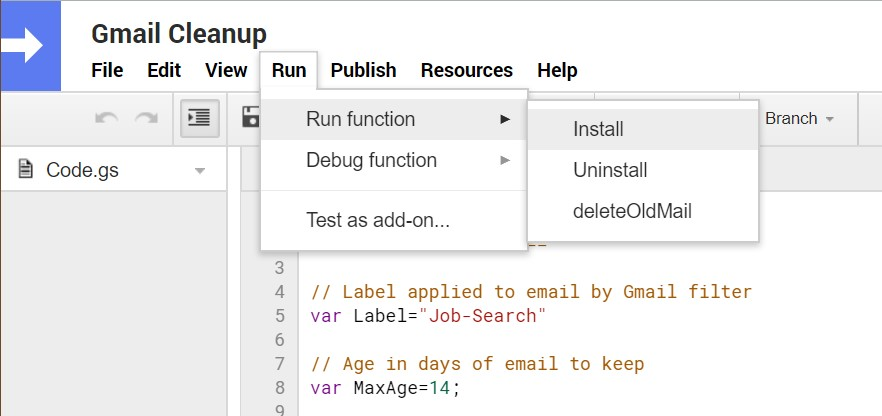
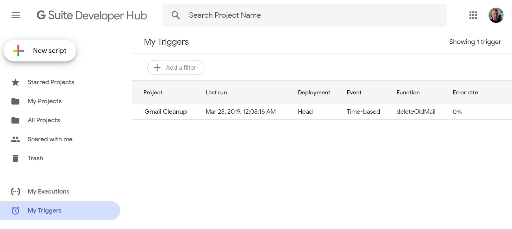
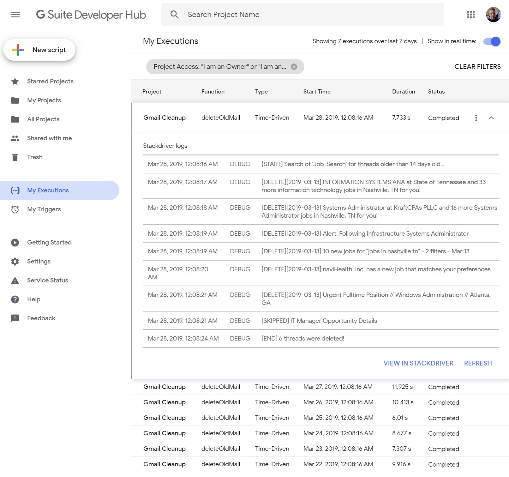

# Gmail-Cleanup
Deletes mail with a particular label after a period of time

## Requirements

The following requirements must be met:

- A Gmail account
- A filter that applies a specific label to target emails. (Assuming you are not cleaning up your entire inbox.)
- A project in the [G Suite Developer Hub](https://script.google.com/home).

## Usage

Work is accomplished by executing functions within the script. This can be done interactively via the editor (see below) or run on a time-based trigger (scheduled).

      
### Installation (run via trigger)

Executing the _Install()_ function will establish a daily trigger.

### Logging

Execution of the script will generate Stackdriver logs viewable in the "My Execution" dashboard.

